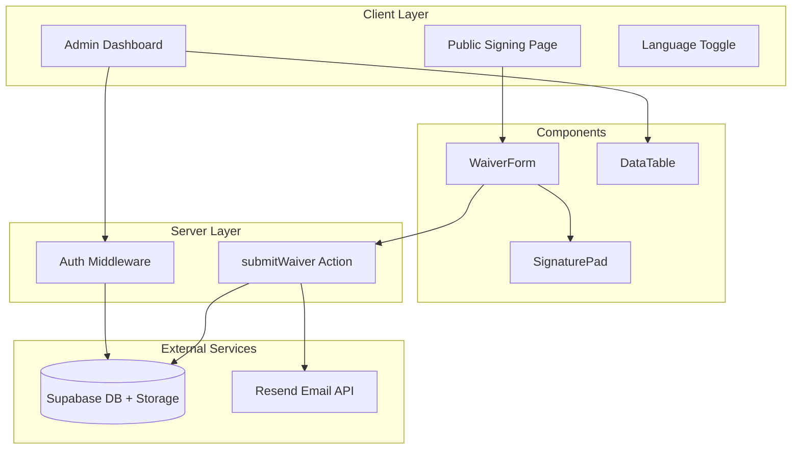
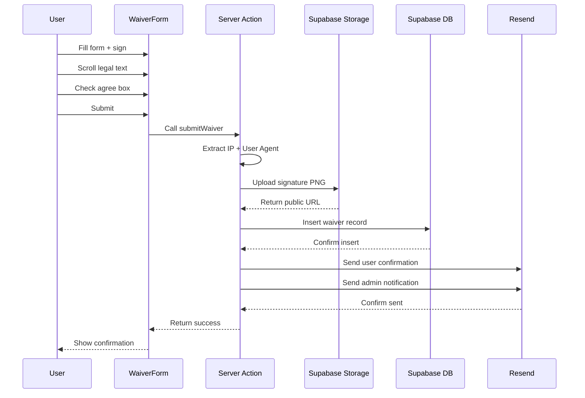

# Home Gym Waiver App Implementation Plan

## Architecture Overview



## Project Structure

```
homegymwaiver/
├── app/
│   ├── layout.tsx              # Root layout with providers
│   ├── page.tsx                # Public signing page
│   ├── admin/
│   │   ├── layout.tsx          # Admin layout with auth check
│   │   ├── page.tsx            # Dashboard with data table
│   │   └── login/page.tsx      # Admin login page
│   └── api/
│       └── auth/callback/route.ts
├── components/
│   ├── ui/                     # Shadcn components
│   ├── waiver-form.tsx
│   ├── signature-pad.tsx
│   ├── language-toggle.tsx
│   ├── legal-text.tsx
│   └── waiver-details-modal.tsx
├── lib/
│   ├── supabase/
│   │   ├── client.ts           # Browser client
│   │   ├── server.ts           # Server client
│   │   └── middleware.ts       # Auth middleware helper
│   ├── translations.ts         # EN/ZH dictionary
│   ├── actions.ts              # Server actions
│   └── validations.ts          # Zod schemas
├── hooks/
│   └── use-translation.ts
├── types/
│   └── index.ts
└── middleware.ts               # Next.js middleware
```

---

## Phase 1: Project Setup

### 1.1 Initialize Next.js Project

- Create Next.js 14 app with TypeScript, Tailwind CSS, App Router
- Install core dependencies:
  - `@supabase/ssr` `@supabase/supabase-js` - Supabase client
  - `resend` - Email service
  - `react-signature-canvas` `@types/react-signature-canvas` - Signature capture
  - `zod` `react-hook-form` `@hookform/resolvers` - Validation
  - `lucide-react` - Icons

### 1.2 Initialize Shadcn UI

- Run `npx shadcn@latest init`
- Add components: `button`, `input`, `card`, `checkbox`, `dialog`, `table`, `toast`, `form`, `label`, `scroll-area`

### 1.3 Environment Configuration

Create `.env.local.example`:

```env
NEXT_PUBLIC_SUPABASE_URL=your_supabase_url
NEXT_PUBLIC_SUPABASE_ANON_KEY=your_anon_key
SUPABASE_SERVICE_ROLE_KEY=your_service_role_key
RESEND_API_KEY=your_resend_api_key
ADMIN_EMAIL=admin@example.com
```

---

## Phase 2: Supabase Setup

### 2.1 Database Schema

SQL migration for `waivers` table:

```sql
CREATE TABLE waivers (
  id UUID PRIMARY KEY DEFAULT gen_random_uuid(),
  full_name TEXT NOT NULL,
  email TEXT NOT NULL,
  phone TEXT NOT NULL,
  emergency_contact_name TEXT NOT NULL,
  emergency_contact_phone TEXT NOT NULL,
  signature_url TEXT NOT NULL,
  ip_address TEXT NOT NULL,
  user_agent TEXT NOT NULL,
  agreed_at TIMESTAMPTZ DEFAULT NOW(),
  language_used TEXT NOT NULL CHECK (language_used IN ('en', 'zh'))
);

-- Enable RLS
ALTER TABLE waivers ENABLE ROW LEVEL SECURITY;

-- Admin-only read policy (service role bypasses RLS)
CREATE POLICY "Service role can do all" ON waivers
  FOR ALL USING (auth.role() = 'service_role');
```

### 2.2 Storage Bucket

Create `signatures` bucket in Supabase Storage with public read access for displaying in admin dashboard.

### 2.3 Supabase Client Helpers

- [`lib/supabase/client.ts`](lib/supabase/client.ts) - Browser client using `createBrowserClient`
- [`lib/supabase/server.ts`](lib/supabase/server.ts) - Server client using `createServerClient` with cookies
- [`lib/supabase/middleware.ts`](lib/supabase/middleware.ts) - Session refresh helper

---

## Phase 3: Translation System

### 3.1 Translation Dictionary

[`lib/translations.ts`](lib/translations.ts) - Flat dictionary structure:

```typescript
export const translations = {
  en: {
    title: "Home Gym Waiver",
    fullName: "Full Name",
    email: "Email",
    // ... all labels, legal text, buttons
  },
  zh: {
    title: "家庭健身房免责声明",
    fullName: "姓名",
    email: "电子邮件",
    // ...
  }
} as const;
```

### 3.2 Translation Hook

[`hooks/use-translation.ts`](hooks/use-translation.ts) - React context + hook:

- `LanguageProvider` wraps the app
- `useTranslation()` returns `{ t, language, setLanguage }`
- Persists language choice in localStorage

---

## Phase 4: Core Components

### 4.1 Language Toggle

[`components/language-toggle.tsx`](components/language-toggle.tsx)

- Simple button showing "中文" / "EN"
- Positioned top-right via absolute positioning
- Calls `setLanguage()` from context

### 4.2 Signature Pad

[`components/signature-pad.tsx`](components/signature-pad.tsx)

- Wraps `react-signature-canvas`
- Exposes `clear()` and `getDataURL()` methods via `forwardRef`
- "Clear / 清除" button below canvas
- Canvas styling with border and responsive width

### 4.3 Legal Text Component

[`components/legal-text.tsx`](components/legal-text.tsx)

- Scrollable container (`max-h-64 overflow-y-auto`)
- Tracks scroll position with `onScroll`
- Calls `onScrolledToBottom()` callback when user reaches bottom
- Displays `legalTextEn` or `legalTextZh` based on language

### 4.4 Waiver Form

[`components/waiver-form.tsx`](components/waiver-form.tsx)

- Uses React Hook Form + Zod resolver
- Fields: Full Name, Email, Phone, Emergency Contact Name, Emergency Contact Phone
- Integrates Legal Text (scroll-to-enable checkbox)
- Checkbox disabled until scrolled to bottom
- Signature Pad required
- Submits to server action

---

## Phase 5: Server Actions

### 5.1 Validation Schema

[`lib/validations.ts`](lib/validations.ts)

```typescript
export const waiverSchema = z.object({
  fullName: z.string().min(2),
  email: z.string().email(),
  phone: z.string().min(10),
  emergencyContactName: z.string().min(2),
  emergencyContactPhone: z.string().min(10),
  signature: z.string().min(1), // base64 data URL
  agreed: z.literal(true),
  language: z.enum(['en', 'zh']),
});
```

### 5.2 Submit Waiver Action

[`lib/actions.ts`](lib/actions.ts) - `submitWaiver` server action:

1. Extract IP from `headers().get('x-forwarded-for')` or `'unknown'`
2. Extract User Agent from `headers().get('user-agent')`
3. Decode base64 signature and upload to Supabase Storage
4. Insert record into `waivers` table
5. Send emails via Resend:

   - **To User**: Confirmation with waiver details and signature
   - **To Admin**: Notification of new submission

---

## Phase 6: Public Signing Page

### 6.1 Main Page

[`app/page.tsx`](app/page.tsx)

- Client component for interactivity
- Language toggle in top-right corner
- Card container with waiver form
- Success state shows confirmation message
- Toast notifications for errors

---

## Phase 7: Admin Dashboard

### 7.1 Admin Login

[`app/admin/login/page.tsx`](app/admin/login/page.tsx)

- Email/password form
- Calls Supabase `signInWithPassword`
- Redirects to `/admin` on success

### 7.2 Auth Middleware

[`middleware.ts`](middleware.ts)

- Protects `/admin` routes (except `/admin/login`)
- Refreshes session tokens
- Redirects unauthenticated users to login

### 7.3 Admin Dashboard Page

[`app/admin/page.tsx`](app/admin/page.tsx)

- Server component fetching all waivers
- Data table with columns: Name, Email, Signed Date
- "View Details" button per row
- "Export CSV" button
- Logout button

### 7.4 Waiver Details Modal

[`components/waiver-details-modal.tsx`](components/waiver-details-modal.tsx)

- Dialog showing full waiver details
- Signature image display
- IP address, user agent, timestamp
- All contact information

---

## Data Flow Diagram



---

## Key Files Summary

| File | Purpose |

|------|---------|

| `lib/supabase/server.ts` | Server-side Supabase client with cookie handling |

| `lib/translations.ts` | EN/ZH translation dictionary |

| `hooks/use-translation.ts` | Translation context and hook |

| `components/waiver-form.tsx` | Main form with all validation |

| `components/signature-pad.tsx` | Canvas signature capture |

| `lib/actions.ts` | Server action for submission |

| `app/admin/page.tsx` | Protected admin dashboard |

| `middleware.ts` | Route protection for admin |

---

## Environment Setup Required by User

Before running, the user must:

1. Create a Supabase project and run the SQL migration
2. Create a `signatures` storage bucket (public)
3. Create an admin user in Supabase Auth
4. Get a Resend API key and verify sender domain
5. Copy `.env.local.example` to `.env.local` and fill values